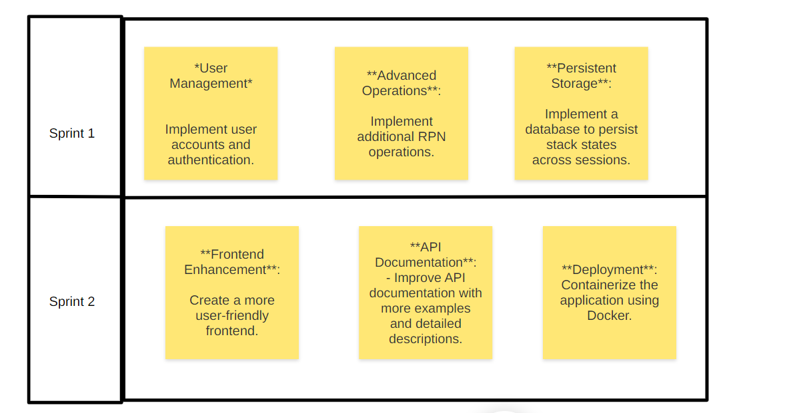

# Roadmap

1. **User Management**:
    - Implement user accounts and authentication.

2. **Advanced Operations**:
    - Implement additional RPN operations.

3. **Persistent Storage**:
    - Implement a database to persist stack states across sessions.

4. **Frontend Enhancement**:
    - Create a more user-friendly frontend.

5. **API Documentation**:
    - Improve API documentation with more examples and detailed descriptions.

6. **Deployment**:
    - Containerize the application using Docker.

